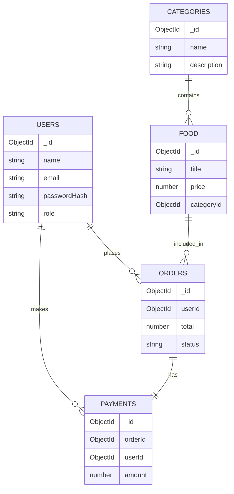

# SE2020 — Individual Assignment Submission Package (Templates)

This document contains complete, ready-to-export content for all required submission documents for the SE2020 individual assignment. Copy each section into its respective file, export to PDF (or PNG for diagrams) and place the final documents into the ZIP named:

- `WDDS01_<YourStudentID>_Submission.zip`

Root folder inside the ZIP must be:

- `SE2020_<YourStudentID>_Submission`

Important notes (read before proceeding):
- Do NOT include source code in the ZIP. All source code must remain in your GitHub repository only.
- The ZIP must contain ONLY documentation files listed in this document.

---

## 1) Problem_Statement.pdf

Title: Food Ordering Mobile Application

Student ID: <Your Student ID>

Student Name: <Your Name>

Module: SE2020

### Introduction

This project is a full-stack MERN (MongoDB, Express.js, React, Node.js) food ordering system designed as a mobile-first web application using Expo and React Native Web. The system provides secure user authentication, a comprehensive REST API backend, and a responsive React frontend deployed to cloud platforms. Users can browse restaurants and food items, manage shopping carts, place orders, and make payments through an intuitive interface.

### Background of the problem

The food delivery and restaurant management industry requires efficient, user-friendly platforms that connect customers with food services. Many small restaurants and food vendors lack scalable digital solutions to manage orders, inventory, and customer interactions. The traditional order-taking process through phone calls or manual systems is time-consuming and error-prone, leading to poor customer experience and operational inefficiency.

### Problem statement

Design and implement a scalable, deployable food ordering web application that enables users to register, login, browse food items by category, manage shopping carts, place orders, and complete payments while ensuring secure access via JWT authentication. The system must provide an intuitive mobile-responsive interface and reliable backend API with comprehensive order and inventory management capabilities.

### Objectives
- Implement a responsive React frontend with Expo for mobile-web compatibility.
- Implement a RESTful Node.js/Express backend with complete CRUD operations for food items, categories, orders, and payments.
- Use MongoDB Atlas for scalable data persistence with proper schema design and indexing.
- Secure all API endpoints using JWT authentication and authorization.
- Implement file upload functionality for food images and user avatars using Multer.
- Deploy frontend and backend to production environments with automatic scaling capabilities.
- Provide comprehensive API documentation and user authentication flow.

### Scope of the system
Define functional and non-functional scope.

Functional:
- User registration, login, and profile management with role-based access control
- JWT-based authentication with protected routes
- Browse food items organized by categories
- Shopping cart management with add, update, and remove operations
- Order creation, tracking, and history viewing
- Payment processing and transaction history
- Admin dashboard for managing categories and food items
- File upload for product images and user avatars

Non-functional:
- Secure password hashing and token handling
- Responsive mobile-first UI design
- Cloud deployment with MongoDB Atlas
- CORS-enabled API for cross-origin requests
- Environmental variable configuration for different deployment stages
- Error handling and validation on both client and server

### Target users
- End customers: Individuals looking to order food online with easy-to-use interface
- Restaurant owners and food vendors: Business owners managing menus and orders
- Administrators: System administrators managing categories, food items, and orders
- Mobile-first users: Customers accessing the platform via mobile browsers and web apps

### Expected outcome
- A fully deployed full-stack food ordering application (frontend on Vercel, backend on Render)
- Comprehensive API with all CRUD endpoints for orders, food items, categories, and payments
- Responsive mobile-web interface supporting all major browsers
- Complete documentation available in GitHub repository
- Functional authentication and authorization system
- Complete database schema with proper relationships and indexing

### Conclusion

This food ordering application addresses the need for scalable, efficient order management in the food service industry. By combining modern web technologies (React, Node.js, MongoDB) with cloud deployment, the system provides a reliable platform for customers and vendors alike. All source code is maintained in the GitHub repository at https://github.com/TMPatipolaarachchi/food-ordering-mobile-app with comprehensive documentation. This submission contains only the required documentation files; the complete source code and deployment information are available in the GitHub repository.

---

## 2) System_Architecture_Diagram (content, export as PNG or PDF)

### Architecture explanation
This system follows a standard client-server architecture:
- Users interact with a React frontend (browser or mobile web).
- The frontend makes HTTP requests to an Express.js backend exposing a REST API.
- The backend performs business logic, authenticates requests with JWT, and reads/writes data to MongoDB Atlas.
- Deployment: frontend is hosted (e.g., Vercel, Netlify, or an S3+CloudFront), backend is hosted (e.g., Heroku, Render, Railway, or a VPS), and MongoDB Atlas is the managed DB service.

Key components:
- User (browser)
- React frontend (static assets + client-side routing)
- Express.js backend (API server)
- REST API endpoints
- MongoDB Atlas (collections)
- JWT Authentication (access tokens)
- Deployment platforms (frontend host, backend host, MongoDB Atlas)

### Mermaid deployment diagram (copy this into a Mermaid-enabled renderer and export)

```mermaid
flowchart LR
	User[User (Browser/Mobile)] -->|HTTP(S)| Frontend[React Frontend]
	Frontend -->|REST API (JSON)| Backend[Express.js Backend]
	Backend -->|Queries| MongoDB[(MongoDB Atlas)]
	Backend -->|Issues/Checks| JWTAuth[(JWT Authentication Service)]
	subgraph Deployment
		FrontendHost[Vercel / Netlify / S3]
		BackendHost[Heroku / Render / Railway]
		MongoDB
	end
	Frontend --- FrontendHost
	Backend --- BackendHost
	MongoDB --- MongoDB
	JWTAuth --- Backend
```

Alternative ASCII diagram:

User -> React Frontend -> Express Backend -> MongoDB Atlas

JWT tokens are issued by the backend upon successful authentication and sent in the `Authorization: Bearer <token>` header for protected endpoints.

---

## 3) Database_Schema_Diagram (content, export as PNG or PDF)

### Collections and description (Food Ordering Application)

1) `users` collection
- `_id` (ObjectId)
- `name` (String)
- `email` (String, unique)
- `passwordHash` (String)
- `role` (String) — e.g., `user`, `admin`
- `avatar` (String)
- `createdAt` (Date)

2) `categories` collection
- `_id` (ObjectId)
- `name` (String)
- `description` (String)
- `icon` (String)
- `createdAt` (Date)

3) `food` collection
- `_id` (ObjectId)
- `title` (String)
- `description` (String)
- `price` (Number)
- `image` (String)
- `categoryId` (ObjectId) — reference to `categories._id`
- `available` (Boolean)
- `createdAt` (Date)

4) `orders` collection
- `_id` (ObjectId)
- `userId` (ObjectId) — reference to `users._id`
- `items` (Array of { itemId: ObjectId, quantity: Number, price: Number })
- `total` (Number)
- `status` (String) — e.g., `pending`, `confirmed`, `delivered`
- `deliveryAddress` (String)
- `createdAt` (Date)

5) `payments` collection
- `_id` (ObjectId)
- `orderId` (ObjectId) — reference to `orders._id`
- `userId` (ObjectId) — reference to `users._id`
- `amount` (Number)
- `method` (String)
- `status` (String) — e.g., `pending`, `completed`, `failed`
- `transactionId` (String)
- `createdAt` (Date)

### MongoDB schema-style example (Mongoose-like JSON)

users:
```
{
	_id: ObjectId,
	name: String,
	email: String,
	passwordHash: String,
	role: "user",
	avatar: String,
	createdAt: Date
}
```

categories:
```
{
	_id: ObjectId,
	name: String,
	description: String,
	icon: String,
	createdAt: Date
}
```

food:
```
{
	_id: ObjectId,
	title: String,
	description: String,
	price: Number,
	image: String,
	categoryId: ObjectId,
	available: Boolean,
	createdAt: Date
}
```

orders:
```
{
	_id: ObjectId,
	userId: ObjectId,
	items: [ { itemId: ObjectId, quantity: Number, price: Number } ],
	total: Number,
	status: String,
	deliveryAddress: String,
	createdAt: Date
}
```

payments:
```
{
	_id: ObjectId,
	orderId: ObjectId,
	userId: ObjectId,
	amount: Number,
	method: String,
	status: String,
	transactionId: String,
	createdAt: Date
}
```

### ER diagram (Mermaid)



Notes on relationships:
- `food.categoryId` references `categories._id` (one category has many food items).
- `orders.userId` references `users._id` (one user can place many orders).
- `payments.orderId` references `orders._id` (one order has one payment).
- `payments.userId` references `users._id` (payment tracks which user made the payment).
- Orders contain multiple items through embedded subdocuments with itemId, quantity, and price.

---

## 4) API_Endpoint_Table.pdf (content)

Below is a complete API endpoint table for the Food Ordering Application.

| Method | Endpoint | Description | Request Body | Response | Authentication Required |
|---|---|---|---|---|---|
| POST | /api/auth/register | Register a new user | { name, email, password, role } | 201 { user, token } | No |
| POST | /api/auth/login | Login and receive JWT | { email, password } | 200 { user, token } | No |
| GET | /api/users/profile | Get logged-in user profile | - | 200 { user } | Yes (Bearer token) |
| PUT | /api/users/profile | Update user profile | { name?, avatar? } | 200 { user } | Yes |
| GET | /api/categories | Get all food categories | - | 200 [ { category } ] | No |
| POST | /api/categories | Create category | { name, description, icon } | 201 { category } | Yes (Admin) |
| PUT | /api/categories/:id | Update category | { name?, description?, icon? } | 200 { category } | Yes (Admin) |
| DELETE | /api/categories/:id | Delete category | - | 204 No Content | Yes (Admin) |
| GET | /api/food | Get all food items | - | 200 [ { food } ] | No |
| GET | /api/food/:id | Get single food item | - | 200 { food } | No |
| POST | /api/food | Create food item | { title, description, price, image, categoryId, available } | 201 { food } | Yes (Admin) |
| PUT | /api/food/:id | Update food item | { title?, description?, price?, image?, available? } | 200 { food } | Yes (Admin) |
| DELETE | /api/food/:id | Delete food item | - | 204 No Content | Yes (Admin) |
| GET | /api/cart | Get user cart | - | 200 { items } | Yes |
| POST | /api/cart | Add item to cart | { foodId, quantity, price } | 201 { cartItem } | Yes |
| PUT | /api/cart/:itemId | Update cart item quantity | { quantity } | 200 { cartItem } | Yes |
| DELETE | /api/cart/:itemId | Remove item from cart | - | 204 No Content | Yes |
| POST | /api/orders | Create order | { items: [ { foodId, quantity, price } ], deliveryAddress } | 201 { order } | Yes |
| GET | /api/orders | Get user orders | - | 200 [ { order } ] | Yes |
| GET | /api/orders/:id | Get order details | - | 200 { order } | Yes |
| PUT | /api/orders/:id | Update order status | { status } | 200 { order } | Yes (Admin) |
| POST | /api/payments | Process payment | { orderId, amount, method } | 201 { payment } | Yes |
| GET | /api/payments/:id | Get payment details | - | 200 { payment } | Yes |
| POST | /api/upload | Upload image file | FormData: file | 201 { url } | Yes |

Example request/response snippets (short):

Register request body:

```
{ "name": "Alice", "email": "alice@example.com", "password": "Secret123", "role": "user" }
```

Register response (success):

```
{
	"user": { "_id": "...", "name": "Alice", "email": "alice@example.com", "role": "user" },
	"token": "<jwt-token>"
}
```

Create order request body:

```
{
	"items": [
		{ "foodId": "64a1b2c3d4e5f6g7h8i9j0k1", "quantity": 2, "price": 15.99 },
		{ "foodId": "64a1b2c3d4e5f6g7h8i9j0k2", "quantity": 1, "price": 8.99 }
	],
	"deliveryAddress": "123 Main Street, City, Country"
}
```

Create order response (success):

```
{
	"_id": "...",
	"userId": "...",
	"items": [ { "foodId": "...", "quantity": 2, "price": 15.99 }, ... ],
	"total": 40.97,
	"status": "pending",
	"deliveryAddress": "123 Main Street, City, Country",
	"createdAt": "2024-05-03T10:30:00Z"
}
```

Authentication: For protected endpoints, the client must send header:

`Authorization: Bearer <jwt-token>`

---

## 5) Student_Responsibility.pdf (content)

Student ID: <Your Student ID>

Student Name: <Your Name>

Module: SE2020

Project Title: Food Ordering Mobile Application

Project Type: MERN / Full Stack Web Application

### Statement of individual work
I certify that this project and all deliverables were completed solely by me and that I have not received unauthorized assistance. All source code is committed to the GitHub repository at https://github.com/TMPatipolaarachchi/food-ordering-mobile-app.

### Responsibilities completed (detailed)
- Frontend development:
	- Built responsive user interfaces using React with Expo and React Native Web
	- Implemented client-side routing with React Navigation Stack
	- Implemented forms for user registration, login, food browsing, and order management
	- Created a shared UI theme system with colors, spacing, typography, and shadow styling
	- Integrated API client with runtime-configurable base URLs
	- Implemented responsive cart management and checkout flow
	- Deployed frontend to Vercel as web static export
- Backend development:
	- Developed complete RESTful API using Node.js and Express.js
	- Implemented authentication and authorization with JWT tokens
	- Implemented input validation and comprehensive error handling
	- Implemented file upload functionality with Multer for product images and avatars
	- Created middleware for authentication, CORS, error handling, and logging with Morgan
	- Configured environment variables for different deployment stages
- Database design:
	- Designed MongoDB Atlas collections for users, categories, food items, orders, and payments
	- Implemented proper data types, validation, and relationships using Mongoose ODM
	- Added indexing for frequently queried fields (email, categoryId, userId)
	- Implemented schema relationships with proper foreign keys
- API development:
	- Designed and implemented 20+ endpoints for complete CRUD and order management
	- Wrote comprehensive API documentation with request/response examples
	- Implemented proper HTTP status codes and error responses
	- Tested all endpoints for functionality and edge cases
- Testing:
	- Performed manual testing for all major user flows (registration, login, category browsing, food browsing, cart management, order creation, payment processing)
	- Tested authentication and authorization on protected endpoints
	- Fixed bugs found during testing and validated fixes
- Deployment:
	- Deployed frontend to Vercel with automatic builds from GitHub
	- Deployed backend to Render with MongoDB Atlas integration
	- Configured CORS for cross-origin requests between frontend and backend
	- Set up environment variables for production deployment
	- Tested deployed application across multiple browsers and devices
- Repository management:
	- Maintained Git history with meaningful, descriptive commits
	- Documented setup and deployment steps in README.md
	- Organized project structure with separate frontend and backend folders
	- Created comprehensive API documentation
	- Added configuration files (render.yaml, .env examples)

### Declaration
I confirm that the above list accurately reflects the work I have personally completed for this assignment. I understand that academic integrity policies apply and that this is an individual submission representing only my work.

Signature: ____________________    Date: ____________________

---

## 6) README.txt (exact template — place this text in `README.txt` inside the ZIP)

GitHub Repository: https://github.com/TMPatipolaarachchi/food-ordering-mobile-app

Student Details:
Student ID: <Your Student ID>
Name: <Your Name>
Module: SE2020
Project Title: Food Ordering Mobile Application

Deployment Details:
Frontend URL: <Your Frontend URL>
Backend URL: <Your Backend API URL>

Project Type: MERN / Full Stack Web Application
Frontend Technology: React, Expo, React Navigation
Backend Technology: Node.js, Express.js
Database: MongoDB Atlas
Authentication: JWT
File Upload: Multer

Project Structure:
- frontend/ — React Expo web application
- backend/ — Node.js Express API server

Important Notes:
- Source code is NOT included in the ZIP file.
- All source code is available at the GitHub repository link above.
- The ZIP file contains only documentation files as required by the assignment.
- Frontend and backend are deployed separately; links are provided above.
- Frontend is deployed to Vercel as web static export from Expo build.
- Backend is deployed to Render with MongoDB Atlas cloud database.

Final Checklist (to confirm before creating the ZIP):
- [ ] ZIP file named `WDDS01_<YourStudentID>_Submission.zip` created
- [ ] Root folder named `SE2020_<YourStudentID>_Submission` inside the ZIP
- [ ] Files included: `Problem_Statement.pdf`, `System_Architecture_Diagram.png` (or .pdf), `Database_Schema_Diagram.png` (or .pdf), `API_Endpoint_Table.pdf`, `Student_Responsibility.pdf`, `README.txt`
- [ ] README.txt contains the correct GitHub repo and deployment URLs
- [ ] No source code files are included in the ZIP

---

## How to produce the final PDF/PNG files (quick steps)
1. Copy each titled section from this `mine.md` into a Word/Google Doc or Markdown editor that can export PDF/PNG.
2. For diagrams, copy the Mermaid code into an online Mermaid renderer (or use VS Code Mermaid preview) and export as PNG/PDF.
3. Name files exactly as required and place them inside the folder `SE2020_<YourStudentID>_Submission`.
4. Zip the folder and name the archive `WDDS01_<YourStudentID>_Submission.zip`.
5. Verify the ZIP contains ONLY the documentation files and that README.txt has working links.

---

If you would like, I can now:
- Auto-fill `README.txt` with values from your repository and deployed URLs (I can scan the repo to extract the Git remote),
- Generate the `API_Endpoint_Table.pdf` draft by extracting route definitions from your backend, or
- Produce the Mermaid diagrams as PNG files and add them to the project folder.

Please tell me which of these you'd like me to do next.

